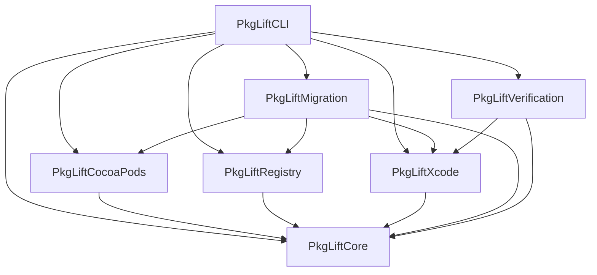

# Architecture

PkgLift is a Swift 6 package split into focused, `Sendable`-safe modules.

## Migration data flow

1. `CommandContext` discovers Xcode projects and workspaces recursively, resolves an explicit workspace/project selection, and rejects normalized or symlinked paths outside the selected root before loading project state.
2. Static CocoaPods parsing combines exact Podfile declarations with lockfile versions and target mappings. Ruby is never evaluated.
3. `MigrationClassifier` permits `AUTO` only for an exact verified mapping, a strict resolved version at or above verified SwiftPM support, a supported Podfile, and exactly one existing target.
4. `MigrationPlan` records the package candidate and typed `removePod`, `addSwiftPackage`, and `linkProduct` actions.
5. `MigrationPlanPreflight` validates that the metadata and typed actions agree and that every destination target still exists.
6. `MigrationEngine` edits the exact Podfile declarations and `.xcodeproj` inside `AtomicMigration`; failures restore both from backup.
7. `StructuralVerifier` checks package presence, product-to-target linkage, and Podfile removal. `BuildVerifier` optionally invokes `xcodebuild` with explicit argument arrays.

The saved plan is the execution contract. The executor does not choose a version, product, repository, project, or target that is absent from that plan.

## Module responsibilities

- `PkgLiftCore`: domain models, configuration, discovery, diagnostics, and safe process execution.
- `PkgLiftCocoaPods`: static Podfile and lockfile parsing plus conservative target mapping.
- `PkgLiftRegistry`: YAML registry loading and validation.
- `PkgLiftXcode`: Xcode project/workspace analysis and all `.xcodeproj` mutation through XcodeProj.
- `PkgLiftMigration`: classification, planning, preflight, exact Podfile editing, Git safety, execution, backup, and rollback.
- `PkgLiftVerification`: structural and optional build verification.
- `PkgLiftCLI`: command parsing and lifecycle orchestration.
